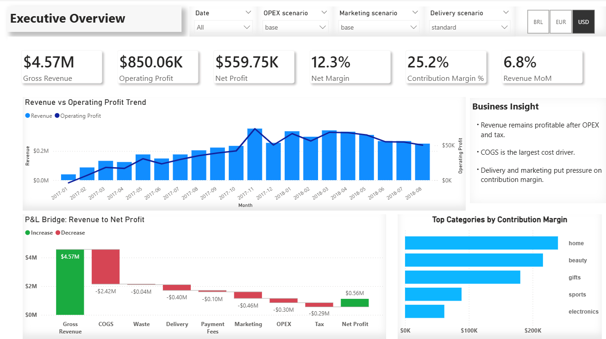
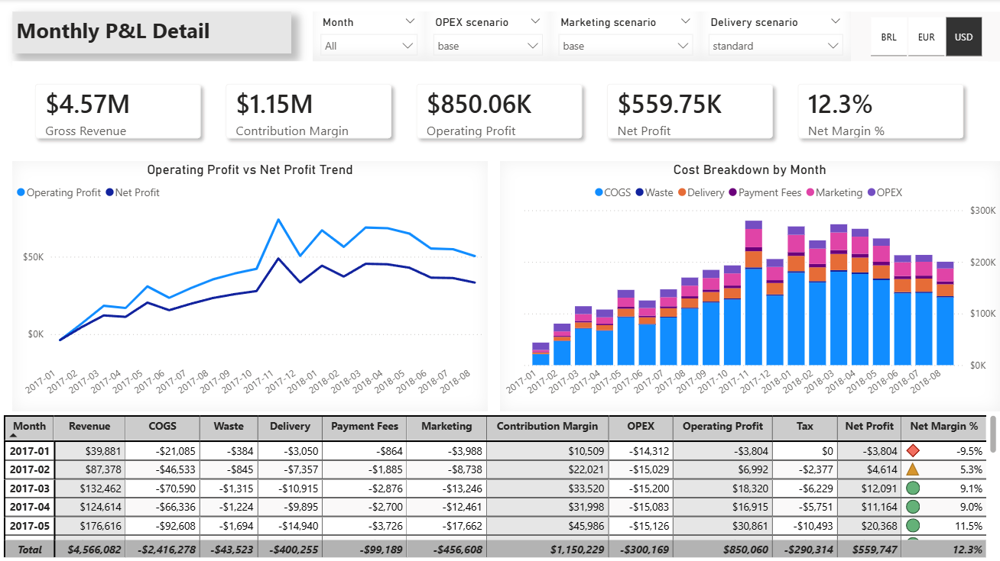
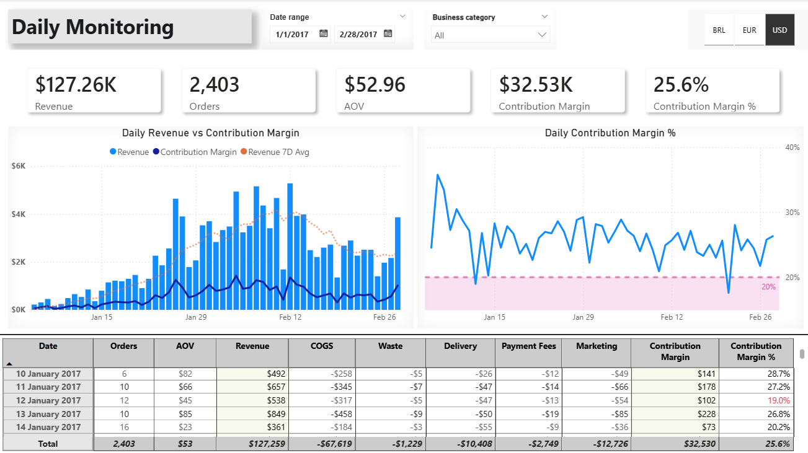
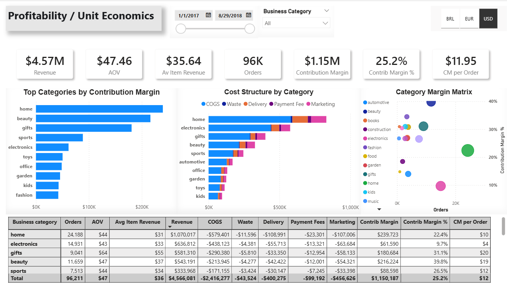
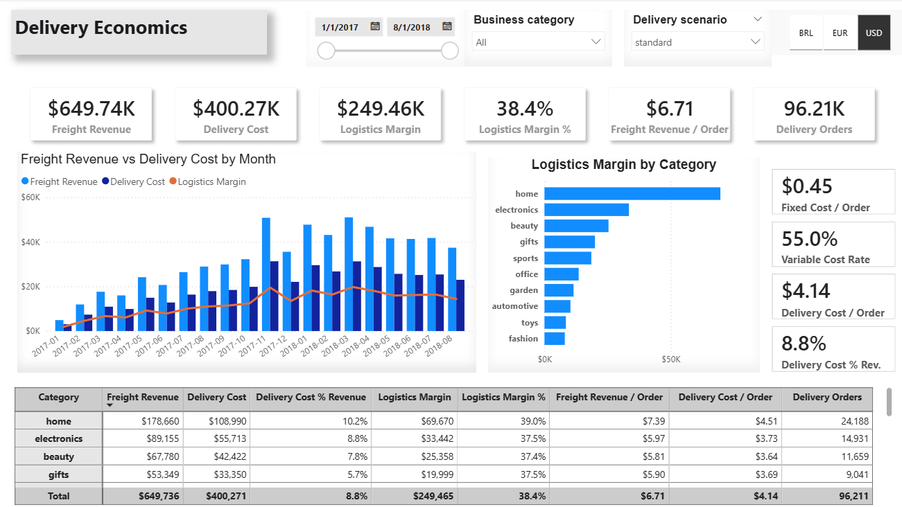
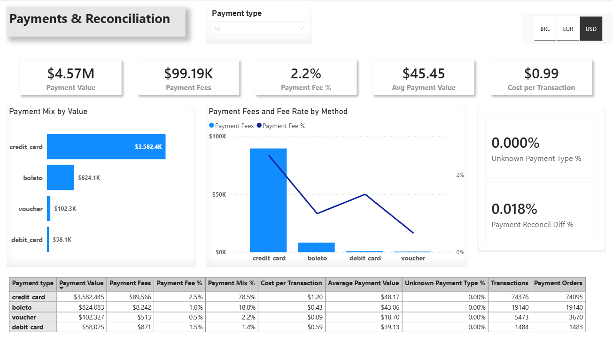
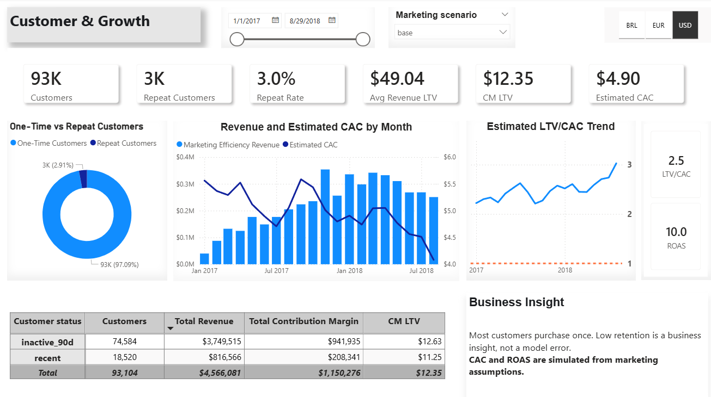

# Olist Retail Finance Analytics Project

## 1. Project Overview

This project is an end-to-end retail finance analytics case built on the public Olist e-commerce dataset.

The goal is to transform transactional marketplace data into a finance-ready analytical layer that can answer practical business questions:

- Which categories generate the most revenue and margin?
- How do payment fees affect profitability?
- Does freight revenue cover simulated delivery cost?
- How do COGS, waste, delivery, marketing, OPEX, and tax assumptions change P&L?
- Which data quality controls are needed before using the data in BI?

The project is designed as a portfolio-grade analytics engineering workflow: PostgreSQL source data, dbt transformations, tested marts, documented metrics, and Power BI-ready outputs.

## Repository Highlights

- End-to-end analytics workflow: PostgreSQL -> dbt -> Power BI
- Scenario-based management P&L with delivery, marketing, OPEX, and tax assumptions
- Tiered activity-based OPEX model instead of a simple revenue percentage
- Multi-currency reporting in BRL, USD, and EUR
- Payment fee simulation and reconciliation controls
- Customer growth metrics with simulated CAC, ROAS, and LTV/CAC
- Final Power BI dashboard pack with PBIX and screenshots

## Quick Start Summary

To reproduce the project locally:

1. Download the public Olist CSV dataset from Kaggle.
2. Create a PostgreSQL database and load the required raw Olist CSV tables.
3. Configure your local dbt `profiles.yml` for PostgreSQL.
4. Run `dbt seed` to load controlled business assumption seeds.
5. Run `dbt build` to create staging, marts, reporting views, and tests.
6. Open `powerbi/pbix/olist_finance_analytics.pbix` in Power BI Desktop and refresh the data source.

Detailed setup instructions are available in [docs/how_to_run.md](docs/how_to_run.md).

Additional documentation:

- [Project Story](docs/project_story.md)
- [Metrics and Grain](docs/metrics_and_grain.md)

## 2. Business Context

The case treats Olist as a retail / marketplace finance analytics environment.

The model covers:

- sales performance
- product and category profitability
- payment method economics
- payment allocation and reconciliation
- delivery economics
- simulated COGS and waste cost
- simulated marketing cost
- contribution margin
- contribution margin after marketing
- net profit after simulated tax
- customer cohorts and simulated marketing efficiency
- daily operational P&L monitoring
- monthly scenario-based P&L with delivery, marketing, and OPEX assumptions

Because the original Olist dataset does not contain real COGS, waste, delivery cost, payment fee, ad spend, CAC, OPEX, or tax data, these inputs are modeled as controlled assumption seeds. This makes the project closer to a real management accounting model while keeping all assumptions explicit and testable.

## 3. Tech Stack

- PostgreSQL: source database and analytical schemas
- dbt: transformation framework, seeds, models, and tests
- Power BI: dashboard, semantic model, DAX measures, PBIX, and screenshots
- Tabular Editor: DAX measure layer automation and dynamic format strings
- Git / GitHub: version control and portfolio presentation
- VS Code: development environment
- DBeaver: database inspection and SQL validation

## 4. Data Sources

The project uses the public [Brazilian E-Commerce Public Dataset by Olist](https://www.kaggle.com/datasets/olistbr/brazilian-ecommerce).

Raw CSV files are not committed to this repository. Download the dataset from Kaggle, load the required CSV files into PostgreSQL, and expose them as the raw Olist source tables used by dbt.

Required raw Olist source tables in PostgreSQL:

- `olist_orders_dataset`
- `olist_order_items_dataset`
- `olist_order_payments_dataset`
- `olist_products_dataset`
- `olist_customers_dataset`
- `product_category_name_translation`

Controlled business assumption seeds:

- `seeds/assumptions/category_mapping.csv`
- `seeds/assumptions/category_assumptions.csv`
- `seeds/payment_fee_rules.csv`
- `seeds/delivery_cost_rules.csv`
- `seeds/opex_assumptions.csv`
- `seeds/marketing_assumptions.csv`
- `seeds/tax_assumptions.csv`
- `seeds/assumptions/fx_rates_monthly.csv`

These seeds define category mapping, COGS rates, waste rates, payment fee rates, delivery cost scenarios, marketing scenarios, tiered activity-based OPEX scenarios, and a 34% base simulated effective corporate income tax rate.

Base currency is BRL. USD/EUR values are converted using monthly historical FX rates from Banco Central do Brasil PTAX monthly average closing sell rates.

Power BI reporting uses a centralized reporting start date of `2017-01-01`. Late-2016 Olist records remain available in raw, staging, intermediate, and mart models, but are treated as an incomplete warm-up period and excluded from BI-facing reporting views and `dim_date`.

## 5. Analytics Architecture

The dbt project follows a production-style analytics architecture:

```text
raw -> staging -> intermediate -> marts -> semantic -> reporting
```

Layer responsibilities:

- `raw`: original PostgreSQL source tables
- `staging`: cleaned, typed, standardized source models
- `intermediate`: reusable joins, allocations, and business logic preparation
- `marts`: BI-ready facts and analytical outputs
- `semantic`: shared metric definitions and BI-facing measure documentation
- `reporting`: Power BI-ready export views and dimensions

## 6. Key Models

Staging models:

- `stg_orders`
- `stg_order_items`
- `stg_payments`
- `stg_products`
- `stg_customers`
- `stg_category_translation`
- `stg_category_mapping`
- `stg_category_assumptions`
- `stg_delivery_cost_rules`
- `stg_opex_assumptions`
- `stg_marketing_assumptions`
- `stg_tax_assumptions`

Intermediate models:

- `int_payments_by_order`: aggregates payments to order grain
- `int_payments_enriched`: applies simulated payment fee logic
- `int_payment_fees_by_order`: aggregates payment fees to order grain
- `int_sales_base`: joins delivered order items with products, categories, and payment totals
- `int_sales_with_payment_allocation`: allocates order-level payments to item-level sales rows
- `int_category_assumptions`: prepares category-level profitability assumptions

Core marts:

- `fact_sales`: delivered item-level sales fact table

Profitability marts:

- `mart_sales_profitability`: item-level profitability model
- `mart_delivery_impact`: delivery economics by month, category, and scenario
- `mart_pnl_daily`: daily contribution margin monitoring after base marketing cost
- `mart_monthly_pnl`: monthly scenario-based P&L with delivery, marketing, OPEX, tax, and net profit

Payments marts:

- `fact_payments_enriched`: payment records enriched with fee logic and quality flags
- `mart_payment_kpis`: payment KPIs by payment type

Growth marts:

- `mart_customer_cohorts`: customer retention by cohort month and activity month
- `mart_customer_metrics`: customer-level order, revenue, margin, lifetime, repeat, and 90-day recency metrics
- `mart_new_customers`: monthly new customer counts
- `mart_marketing_efficiency`: simulated CAC and ROAS by month and marketing scenario

## 7. Business Logic

Main metric definitions:

```text
product_revenue = item_revenue
freight_revenue = freight_value
gross_revenue = item_revenue + freight_value
```

Simulated costs:

```text
simulated_cogs = product_revenue * cogs_rate
simulated_waste_cost = product_revenue * cogs_rate * waste_rate
simulated_payment_fee = payment_value * payment_fee_rate
simulated_delivery_cost = fixed_cost_per_order_brl + freight_value * variable_delivery_rate
simulated_marketing_cost = gross_revenue * marketing_rate
base_fixed_ga_opex = base_fixed_ga_brl
variable_ops_opex = total_orders * variable_ops_per_order_brl
step_infrastructure_opex = infrastructure_tiers * step_infrastructure_cost_brl
simulated_opex = base_fixed_ga_opex + variable_ops_opex + step_infrastructure_opex
```

Profitability metrics:

```text
pre_marketing_contribution_margin =
    gross_revenue
    - simulated_cogs
    - simulated_waste_cost
    - simulated_delivery_cost
    - simulated_payment_fee

contribution_margin =
    pre_marketing_contribution_margin
    - simulated_marketing_cost
```

The dashboard uses `Contribution Margin` as the margin after all variable costs, including marketing. The pre-marketing contribution margin is retained as an intermediate bridge metric.

Monthly P&L logic:

```text
infrastructure_tiers =
    greatest(
        ceil(total_orders::numeric / nullif(capacity_tier_orders, 0)) - 1,
        0
    )

simulated_opex =
    base_fixed_ga_opex
    + variable_ops_opex
    + step_infrastructure_opex

opex_fixed_ratio =
    (base_fixed_ga_opex + step_infrastructure_opex)
    / nullif(simulated_opex, 0)

operating_profit = contribution_margin - simulated_opex
taxable_profit = operating_profit when operating_profit > 0 else 0
simulated_tax = taxable_profit * tax_rate
net_profit = operating_profit - simulated_tax
```

The first capacity tier is assumed to be covered by base fixed G&A. Additional infrastructure step costs only start when monthly order volume exceeds the configured capacity tier.

With the current Olist history and configured capacity tiers, infrastructure tiers may remain at 0 in historical months. This is expected: the step-cost logic is available for stress testing and future scale scenarios, while fixed G&A and variable operations cost still drive OPEX scenario differences.

`opex_fixed_ratio` shows operating leverage by measuring the fixed and infrastructure-driven share of total OPEX.

Delivery cost is simulated as a mixed logistics cost, not as a simple percentage of freight revenue. Monthly delivery cost uses order volume for the fixed component and freight revenue for the variable component. Item/category-level reporting allocates the fixed cost component across item rows so category totals remain additive.

Tax is simulated because Olist does not contain real tax data. The project uses a 34% base simulated effective corporate income tax rate and applies it only to positive operating profit.

P&L structure:

```text
Gross Revenue
- COGS
- Waste
- Delivery
- Payment Fees
= Pre-Marketing Contribution Margin
- Marketing
= Contribution Margin
- OPEX
= Operating Profit
- Tax
= Net Profit
```

Payment allocation:

- Payments are stored at order level.
- Sales are modeled at item level.
- Order-level payment value and payment fees are allocated to item rows proportionally by item revenue.
- The final item line receives the rounding remainder so item-level allocation reconciles to order-level totals.

## 8. Data Quality & Reconciliation Controls

The project includes dbt tests for source quality, model contracts, accepted values, relationship integrity, and custom reconciliation.

Key controls:

- 21 additional dbt data tests added for accepted values and relationships
- category mapping coverage test
- category assumptions coverage test
- payment value allocation reconciliation
- payment fee allocation reconciliation
- accepted values for order statuses, scenarios, payment types, delivery rules, and quality flags
- relationship tests between orders, customers, products, payments, facts, and assumption mappings
- marketing rate range test to ensure assumption rates stay between 0 and 1
- tax rate range test to ensure the standard tax rate stays between 0 and 1
- Power BI reporting start date test to ensure BI-facing views do not include the incomplete late-2016 warm-up period

Known data nuance:

- Three item rows have missing allocated payment values because payment data is missing in the source.
- This is treated as a data quality case rather than forcing a misleading `not_null` constraint.

Latest full validation:

```text
dbt build
PASS=270 WARN=0 ERROR=0 SKIP=0
```

## 9. Key Outputs

Main BI-ready outputs include:

- `mart_sales_profitability`: item-level revenue, cost, contribution margin, and base marketing cost analysis
- `mart_payment_kpis`: payment value and simulated fee KPIs by payment type
- `mart_delivery_impact`: freight revenue, simulated delivery cost, and delivery margin by scenario
- `mart_pnl_daily`: daily operational contribution margin monitoring after base marketing cost
- `mart_monthly_pnl`: monthly scenario-based P&L with delivery, marketing, OPEX, tax, operating profit, and net profit
- `rpt_powerbi_monthly_pnl`: monthly P&L reporting view enriched with USD/EUR converted monetary fields
- `rpt_powerbi_marketing_efficiency`: marketing efficiency reporting view enriched with USD/EUR converted monetary fields

Recent row counts:

- `mart_sales_profitability`: 110,197 rows
- `mart_delivery_impact`: 1,002 rows
- `mart_pnl_daily`: 612 rows
- `mart_monthly_pnl`: 207 rows

## Power BI Data Model

The project includes a dedicated reporting layer for BI tools.

The Power BI reporting layer applies a centralized reporting window starting on `2017-01-01`. This keeps Executive Overview, Monthly P&L, Daily Monitoring, Profitability / Unit Economics, Delivery Economics, Payments, and Customer & Growth on the same analysis period without relying on manual page-level filters.

### Reporting Views

- `rpt_powerbi_sales_profitability`
- `rpt_powerbi_monthly_pnl`
- `rpt_powerbi_daily_pnl`
- `rpt_powerbi_delivery`
- `rpt_powerbi_payments`
- `rpt_powerbi_customer_cohorts`
- `rpt_powerbi_customer_metrics`
- `rpt_powerbi_marketing_efficiency`

### Dimensions

- `dim_date`
- `dim_category`

### Model Design

A star-schema-like structure is used:

- `dim_date` is connected to daily and monthly reporting tables
- `dim_category` is used for category-level profitability and delivery analysis
- reporting views provide clean, BI-ready datasets instead of exposing internal marts directly
- payment reporting is filtered to delivered orders so payment economics reconcile with finance and profitability pages

## Power BI Dashboard Layer

Power BI dashboard documentation is stored in `powerbi/`.

The dashboard uses dbt reporting views and dimensions as its BI-ready semantic source. The PBIX file is stored in `powerbi/pbix/`, and dashboard screenshots are stored in `powerbi/screenshots/`.

### Dashboard Preview

#### Executive Overview



#### Monthly P&L Detail



#### Daily Monitoring



#### Profitability / Unit Economics



#### Delivery Economics



#### Payments & Reconciliation



#### Customer & Growth



## 10. Power BI Dashboard Pages

Completed Power BI dashboard pages:

- Executive Overview: CFO-level revenue, contribution margin, operating profit, net profit, P&L bridge, and category margin signals.
- Monthly P&L Detail: scenario-based management P&L with revenue, costs, OPEX, tax, net profit, and margin trend.
- Daily Monitoring: daily operational revenue, orders, AOV, contribution margin, rolling revenue average, and margin threshold monitoring.
- Profitability / Unit Economics: category contribution, cost structure, margin matrix, AOV, average item revenue, and CM per order.
- Delivery Economics: freight revenue, mixed delivery cost model, logistics margin, fixed/variable delivery assumptions, and category delivery economics.
- Payments & Reconciliation: delivered-order payment mix, simulated payment fees, transaction counts, unknown payment type checks, and reconciliation indicators.
- Customer & Growth: customer count, repeat behavior, 90-day recency status, simulated CAC, ROAS, revenue LTV, CM LTV, and LTV/CAC.

Supporting technical validation pages, intended to remain hidden in the final report:

- Model Check
- Measure Check
- FX Check

## 11. How to Run

See [docs/how_to_run.md](docs/how_to_run.md) for detailed local setup instructions covering:

- PostgreSQL database setup
- Olist raw CSV download and loading
- dbt profile configuration
- dbt seed/build sequence
- Power BI data source refresh

Important: `dbt seed` loads only the controlled assumption CSV files from this repository. It does not load the external raw Olist dataset.

## 12. Project Status

Current status: completed end-to-end analytics engineering and Power BI dashboard portfolio project.

Completed:

- PostgreSQL raw source setup
- dbt project structure
- staging, intermediate, marts, reporting, and Power BI semantic documentation
- category mapping and assumption logic
- payment fee simulation
- Marketing cost simulation
- tax simulation on positive monthly operating profit
- item-level payment allocation
- delivery cost scenario modeling
- daily and monthly P&L marts with delivery, marketing, and OPEX scenario logic
- Power BI reporting views and dimensions
- Customer & Growth marts and reporting views
- Power BI semantic model and relationships
- DAX measure catalog and Tabular Editor automation
- multi-currency reporting in BRL, USD, and EUR
- completed Power BI dashboard pages
- dashboard screenshots and PBIX artifact
- custom reconciliation tests
- additional accepted value and relationship tests
- latest targeted Power BI/reporting validation passing with `PASS=139 WARN=0 ERROR=0 SKIP=0`
